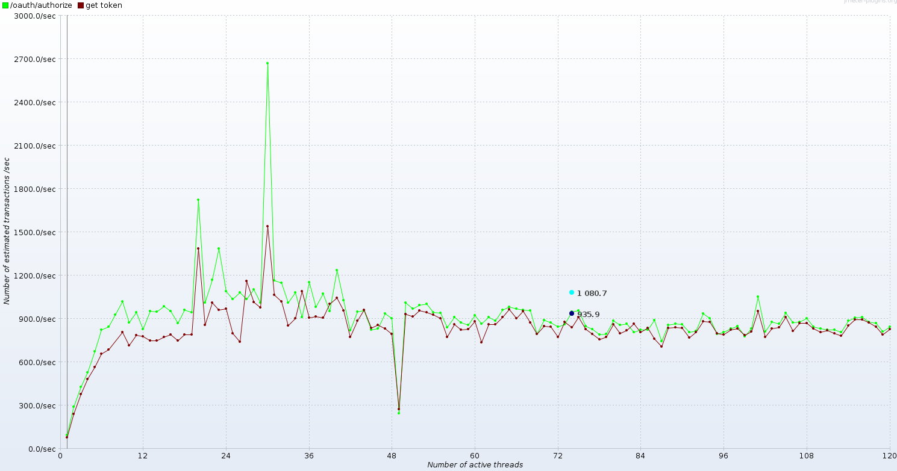
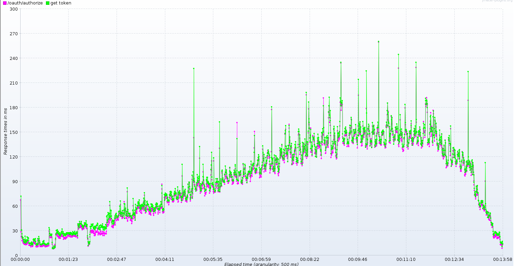
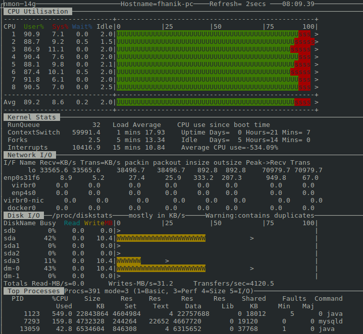
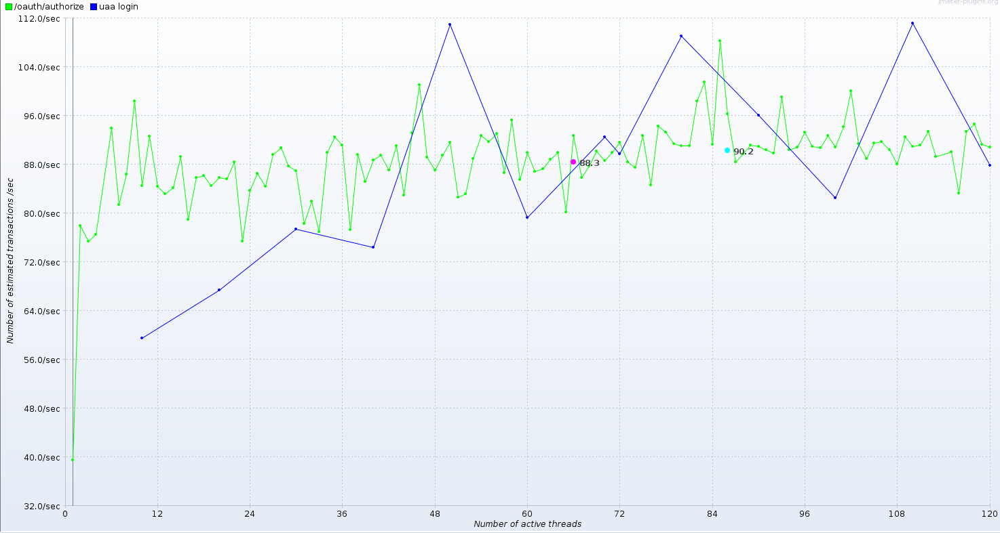
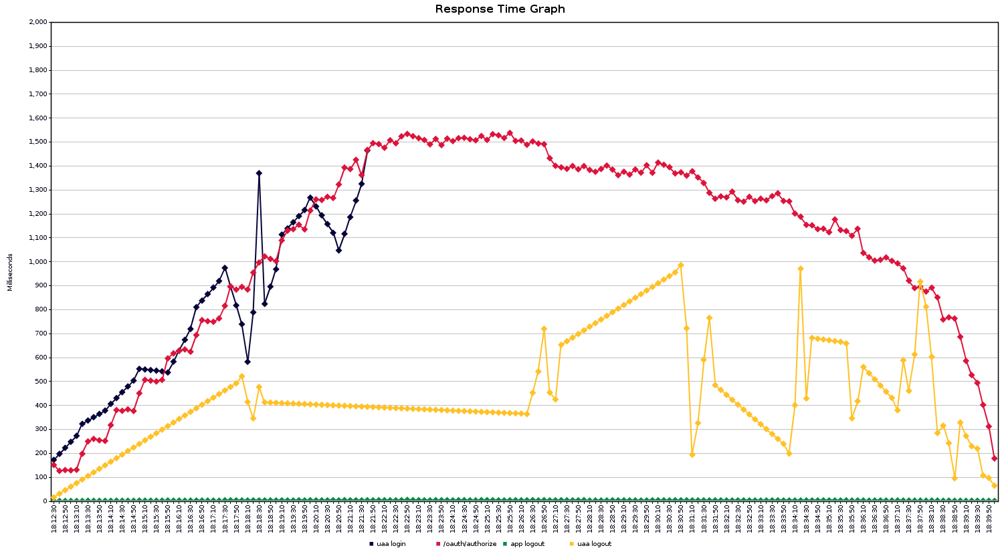
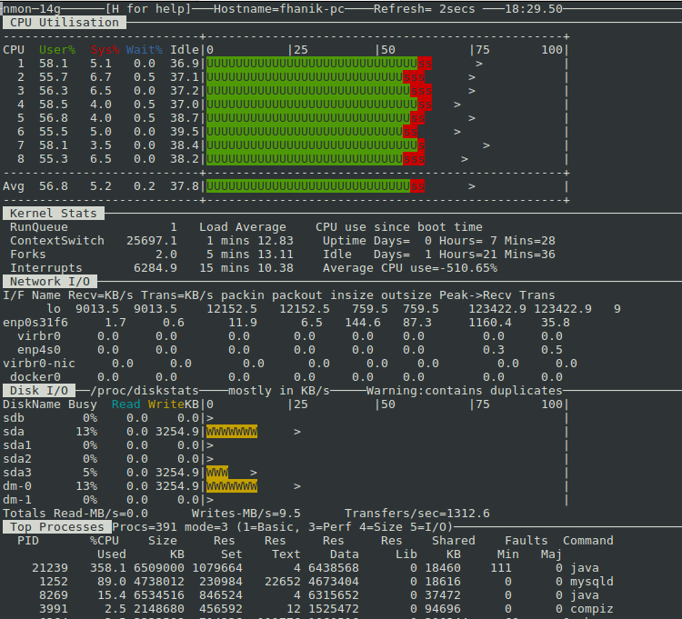
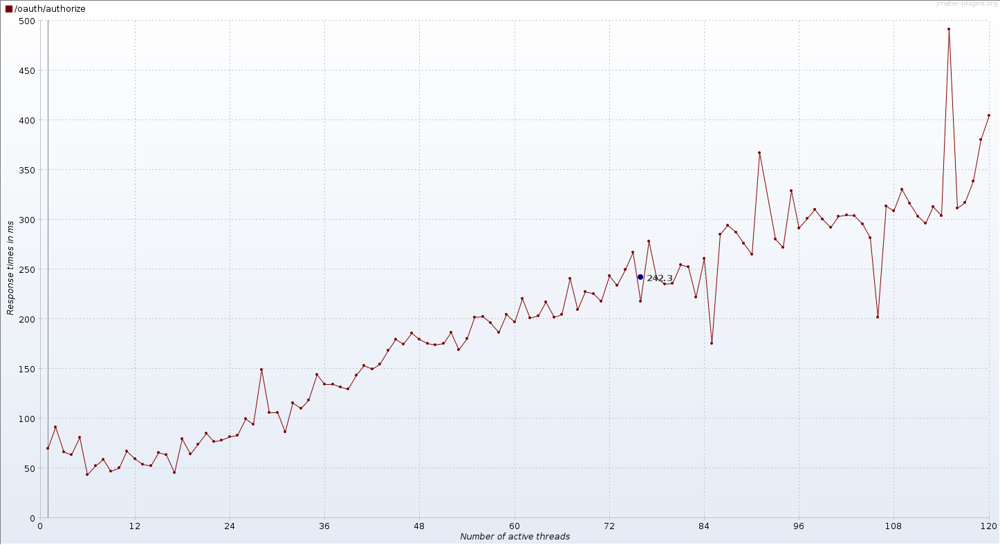
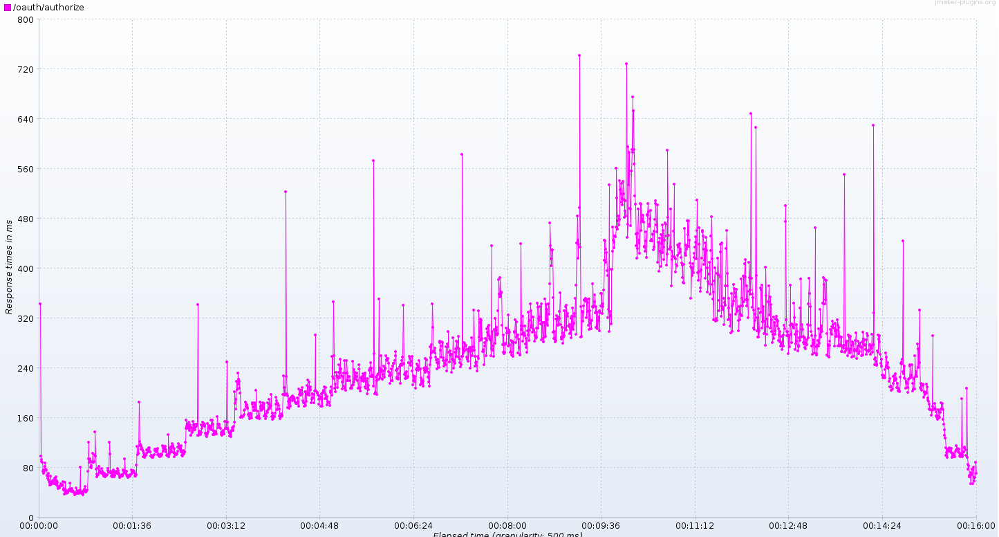
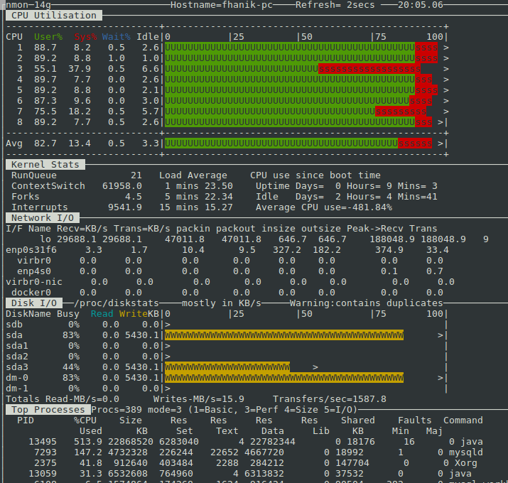

# jmeter
repo for jmeter scripts to demonstrate jmeter capabilities. 

The following test suites have been created as demonstration

1. [UAA only - complex auth code flow](#complex-auth-flow-with-a-throttled-uaa-and-no-third-party-app) 
1. Login, Authorize, Logout - authcode flow [simple-auth-code-test.jmx](uaa/simple-auth-code-test.jmx)
1. [Login, Repeat Authorize with third party app](#complex-multistep-flow-with-third-party-app---example-output), Logout - complex authcode flow 
1. [Client Credentials](#client-credentials-flow) [simple-client-credentials.jmx](uaa/simple-client-credentials.jmx)
1. Password Grant [simple-password-grant.jmx](uaa/simple-password-grant.jmx)

## Complex Auth Flow with a throttled UAA and no third party app

In this [test](uaa/single-app-login-then-auth-code-test.jmx) run we introduce the concept of throttling traffic to better suite
the UAA's concurrency profile. We set maxThreads="30". We also remove the third party application
so that we only test the UAA performance, not sharing resources with the application.

### Thread Step Up

### Thread Count to Response Time

### Thread Count to Throughput

### Response Time over Time

### System Snapshot

## Introduction
We currently have four different kinds of tests added

* client_credentials - simple client_credentials grant type
* password - simple password grant type
* login and authorize - login and authorize then logout
* login then repeat authorize - login once, then repeat oauth/authorize with the authenticated session

# setup
This repository has everything, with the exception for Java VM,  you need to run Apache Jmeter
We use `.envrc` to automatically configure your path. 
If you do not use [direnv](https://github.com/direnv/direnv) you have to run a bash shell and run the command

    source .envrc
    
Verify that jmeter is on your path by typing `which jmeter`

# performance tests

## Authorization Code Flow

### prerequisites
Our load test assumes that the user has already approved necessary scopes. 
The load test just test the login/authorize actions.
1. launch UAA in a separate window using the command `./gradlew run`
1. Go to the [sample app, http://localhost:8080/app](http://localhost:8080/app)
1. Login using `marissa/koala` and accept all scopes

### Login-Authorize-Logout
#### launch jmeter

Define [test](uaa/simple-auth-code-test.jmx)

    jmeter -t uaa/simple-auth-code-test.jmx

Press the `Play` button or use the menu Run->Start to launch the test

### Login-Authorize-Repeat-Authorize
#### launch jmeter

Define [test](uaa/login-then-auth-code-test.jmx)

    jmeter -t uaa/login-then-auth-code-test.jmx

Press the `Play` button or use the menu Run->Start to launch the test

## Client Credentials Flow

### prerequisites
UAA is up and running and has the `admin` client with the password `adminsecret`

### launch jmeter

     jmeter -t uaa/simple-client-credentials.jmx

## Password Flow

### prerequisites
UAA is up and running and has the `cf` client with the password `<empty string>` 
and user `marissa` with password `koala`.

### launch jmeter

     jmeter -t uaa/simple-password-grant.jmx

## Complex Multistep Flow With Third Party App - Example Output

Test Logic - Each user
1. Logs in to the UAA
1. Logs into third party app using authorization code flow
1. Logs out of third party app
1. Repeat step 2) and 3) 1000 times
1. Logs out of UAA 

Endpoints Exercised - in order
* /uaa/login.do
* /app/
* /uaa/oauth/authorize
* /app/?code=<auth code>
* /uaa/oauth/token
* /uaa/userinfo
* /app/logout
* /uaa/logout.do

### Thread Step Up

### Thread Count to Response Time

### Thread Count to Throughput

### Response Time over Time

### System Snapshot

## Throttled UAA

In this test run we introduce the concept of throttling traffic to better suite
the UAA's concurrency profile. We set maxThreads="30"

### Thread Step Up

### Thread Count to Response Time

### Thread Count to Throughput

### Response Time over Time

### System Snapshot

